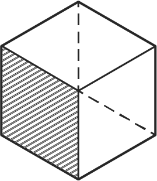

<p align="center">
  
</p>
# mesh
A pure open source SCSS Framework, with no frills but a modular approach to a responsive grid system and other utilities by Ainsley Clark. 

## Why mesh?

### Versatile
It's based on the principle that every website is different. Most CSS frameworks have consistent styling, you can almost tell if a website was designed with a particular one. Here, we use wire-framing to show you what it could look like, not what it will look like.

### Fast
It's quick - under 100kb minified. mesh was built with a very modular approach, meaning you can cut back on classes & components you won't use by using our scss files.

### Functional
It has a huge amount of very useful utility classes, which enables you to write HTML quicker. It's extremely easy to pick up and will save you bags of time in the long run.
No !important, so less of a headache using JS.

## Contributing
mesh is still in its early days, if you wish to contribute, please do so! It would be appreciated. 
Please email info@ainsleyclark.com if you have any questions, I will be more than happy to answer them. 

**How to contribute:**
1. Clone this repo and create a new branch.
2. Using node/npm enter `npm install` to install dev dependencies.
3. Then use `npm run dev` to watch & compile scss.
4. When finished use `npm run prod` to clean compiled css files. 
5. Merge & commit, create new pull request.

**What to contribute:**
Any ideas are welcome. The majority of the utility classes are done so UI components are needed (remember CSS only!), including: 
- Cards
- Modals
- Toasts
- Chips
- Forms
- Nav
- Header
- Hero Section
- Tabs
- Tooltip
- Icons
- Breadcrumbs
- Pagination

**Notes:**
- Please do not edit ***mesh.css*** directly, they are automatically generated. 
- Get yourself familiar with the demo pages to see how things work. 

## Documentation

meshcss.com is currently in progress. To get a kickstart on implementing mesh into your site, or to help contribute - please see the documentation below.

## Grid
mesh uses the conventional containers, rows and columns to layout and align content, it's built with flex box and is fully responsive. Here's an example

```
<div class="container">
    <div class="row">
        <div class="col-12 col-tab-6 col-desk-4 col-hd-3">
          I'm a column, I take up 12 columns at mobile, 6 at tablet, 4 at dekstop and 3 in hd screens
        </div>
    </div>
</div>
```

See how our grid system works:

|                         | Default       | Mobile       | Tablet       | Desktop      | HD           |
| ----------------------- | ------------- | ------------ | ------------ | ------------ | ------------ |
| Minimum Width           | 0             | 568px        | 768px        | 1024px       | 1408px       |  
| Max container width     | None          | 518px        | 718px        | 974px        | 1358px       |
| Class prefix            | .col-         | .col-mob     | .col-tab     | .col-desk    | .col-hd      | 
| Gap width               | 0.75rem       | 0.75rem      | 0.75rem      | 0.75rem      | 0.75rem      |    

### Containers
- A container can be at fixed size, and will gracefully become smaller as screen size gets smaller.

```
<div class="container">
</div>
```

- Or a container can be at full width of the screen.

```
<div class="container-fullwidth">
</div>
```

### Rows
- Rows live inside containers, they are at full width and are wrappers for columns. 
- Rows use flexbox by default, so you can add any of our responsive flex classes to them to align them horizontally and vertically.

```
<div class="row">
</div>
```

### Columns
- Columns live inside rows, there can be a maximum of 12 columns in each row. If there are more, the column will wrap to the next line.
- The column prefix is **col-modifier-amount** as shown below.
- The **col-auto** class will fill up all available space, great if you want a column to have a predefined width.
- If you decide to leave the default (*col-) out of the class declaration, it will default to 12, saving you're typing.

```
<div class="col-12 col-mob-10 col-tab-6 col-desk-4 col-hd-4">
</div>
```
### Offsetting Columns
- In order to move columns along within a row, you can use the offset classes, which are responsive.
- Below will offset a column by 6 for tablet.
- **Note:** This will also offset 6 columns for desktop and HD as well. To reset it add - ```col-desk-0```

```
<div class="col-12 col-tab-6 offset-tab-6">
</div>
```

### Notes
- Rows are nest-able, meaning you can have rows that live inside columns.

## Flex
The whole of flexbox is bundled with mesh, meaning you can use them inline in html, making vertical and horizontal cantering a doddle. As a bonus all classes are responsive. 
In order to make a container flexboxish add d-flex or d-inline-flex as a class. See our display options for more details.

If you need help with any flexboxy relatedness, check out https://css-tricks.com/snippets/css/a-guide-to-flexbox/

- ```.flex-row```
- ```.flex-row-reverse```
- ```.flex-column```
- ```.flex-column-reverse```
- ```.justify-content-start```
- ```.justify-content-end```
- ```.justify-content-center```
- ```.justify-content-between```
- ```.justify-content-around```
- ```.align-self-start```
- ```.align-self-end```
- ```.align-self-center```
- ```.align-self-baseline```
- ```.align-self-stretch```
- ```.align-items-start```
- ```.align-items-end```
- ```.align-items-center```
- ```.align-items-baseline```
- ```.align-items-stretch```
- ```.align-content-start```
- ```.align-content-end```
- ```.align-content-center```
- ```.align-content-baseline```
- ```.align-content-stretch```
- ```.flex-wrap```
- ```.flex-nowrap```
- ```.flex-fill```
- ```.flex-grow-0```
- ```.flex-grow-1```
- ```.flex-shrink-0```
- ```.flex-shrink-1```

**Flex Responsiveness:** Just add the prefix before the last word of the classes listed above, for example:
- ```.flex-tab-row```
- ```.align-items-hd-center```
- ```.flex-desk-column```

## Order
Order will allow you to change the visual order of columns (or flex items). You may want to order something first on desktop but last when it shrinks down to mobile. Here are our classes to help you with that:

| Notation                |                                                        |
| ----------------------- | ------------------------------------------------------ | 
| Default                 | order-{value} for default                              |   
| Responsive              | order-{breakpoint}-{value} for mob, tab, desk & hd     | 

- ```.order-first```
- ```.order-last```
- ```.order-1```
- ```.order-2```
- ```.order-3```
- ```.order-4```
- ```.order-5```
- ```.order-6```
- ```.order-7```
- ```.order-8```
- ```.order-9```
- ```.order-10```
- ```.order-11```
- ```.order-12```

They're also responsive (as well as desk & HD):

- ```.order-tab-first```
- ```.order-tab-last```
- ```.order-tab-1```
- ```.order-tab-2```
- ```.order-tab-3```
- ```.order-tab-4```
- ```.order-tab-5```
- ```.order-tab-6```
- ```.order-tab-7```
- ```.order-tab-8```
- ```.order-tab-9```
- ```.order-tab-10```
- ```.order-tab-11```
- ```.order-tab-12```

## Display
You can toggle the display value of your components with ease with our display utility classes.

| Notation                |                                                    |
| ----------------------- | -------------------------------------------------- | 
| Default                 | d-{value} for default                              |   
| Responsive              | d-{breakpoint}-{value} for mob, tab, desk & hd     | 


- ```.d-none```
- ```.d-inline```
- ```.d-inline-block```
- ```.d-block```
- ```.d-flex```
- ```.d-inline-flex```
- ```.d-table```
- ```.d-table-row```
- ```.d-table-cell```

## Spacing
Spacing is overwhelming, especially when it comes to making it responsive. mesh makes it easy and provides a shorthand responsive margin and padding utility classes.


| Notation                |                                                                   |
| ----------------------- | ----------------------------------------------------------------- | 
| Default                 | {property}{sides}-{size}                                          |   
| Responsive              | {property}{sides}-{breakpoint}-{size} for mob, tab, desk & hd     | 

### Where:
**Property** is either m for margin or p for padding

**Sides** is t for top, b for bottom, l for left, r for right

**Size** is from 0 (no padding or margin) to 5 where:
  - 1 is 0.5rem
  - 2 is 0.75rem
  - 3 is 1rem
  - 4 is 2rem
  - 5 is 3rem


#### Examples
```
<div class="my-3 my-tab-4 my-desk-5">
</div>
```
This gives us 1rem of margin on the y axis as default, 2rem margin for tablet and 3rem for desktop

```
<div class="pt-5 pt-hd-0">
</div>
```
This gives us 3rem of padding top as default but nothing for HD screens.

```
<div class="p-5">
</div>
```
This gives us 3rem of padding on all sides, on all screens.


## Position
mesh has responsive position classes! You can have something relative for mobile, but absolute for desktop making, like so:

| Notation                |                                                       |          
| ----------------------- | ----------------------------------------------------- | 
| Default                 | p-{position}                                          |   
| Responsive              | p-{breakpoint}-{position} for mob, tab, desk & hd     | 

- ```.p-relative```
- ```.p-absolute```
- ```.p-fixed```
- ```.p-static```
- ```.p-sticky```

And for responsiveness: 

- ```.p-mob-relative```
- ```.p-desk-absolute```
- ```.p-tab-fixed```
- ```.p-hd-static```
- ```.p-tab-sticky```

## Sizing
You can easily make a component wide/narrow or tall/short with our width and height utility classes. These classes are also responsive.

| Notation                |                                                              |               
| ----------------------- | ------------------------------------------------------------ | 
| Default                 | {property}-{amount}                                          |   
| Responsive              | {property}-{breakpoint}-{amount} for mob, tab, desk & hd     | 

### Where:
**Property** is either w for width or h for height

**Amount** is from 0 to 100 in increments of 10.

Width:
- ```.w-10```
- ```.w-20```
- ```.w-30```
- ```.w-40```
- ```.w-50```
- ```.w-60```
- ```.w-70```
- ```.w-80```
- ```.w-90```
- ```.w-100```

Height:
- ```.h-10```
- ```.h-20```
- ```.h-30```
- ```.h-40```
- ```.h-50```
- ```.h-60```
- ```.h-70```
- ```.h-80```
- ```.h-90```
- ```.h-100```

And for responsiveness: 

- ```.w-mob-10```
- ```.w-tab-20```
- ```.h-desk-30```
- ```.h-hd-40```

## Colors
Our colour scheme as been taken from googles's very own materialistic color palette. Which you can see here: 

https://material.io/tools/color/#!/?view.left=0&view.right=0&primary.color=FFEB3B

It features white & black, and 19 base colors with 4 darken classes & 5 lighten classes. 
You can use these as ***colors*** or ***background colors***.

| Notation                |                                                              |               
| ----------------------- | ------------------------------------------------------------ | 
| Default                 | {property}-{color}                                           | 
| Shade                   | {property}-{color}-{shade}-{amount}                          | 
   
### Where:
**Property** is either c for color or bg for background color

**Color** is one of listed below.

**Shade** is lighten or darken

**Amount** is 1 to 5 for lighten or 1 to 4 for darken.

- red
- pink
- purple
- deep-purple
- indigo
- blue
- light-blue
- cyan
- teal
- green
- light-green
- lime
- yellow
- amber
- orange
- deep-orange
- brown
- grey
- blue-grey

#### Examples
```
<div class="bg-amber">
</div>
```
Amber background

```
<div class="c-teal-darken-3">
</div>
```
Teal color, darken by 3

## Text
Here are some handy classes for all things text. All of our text classes begin with hte prefix ```t-{property}```.

### Unresponsive Classes

- ```.t-decoration-none``` - Font weight, light
- ```.t-normal``` - Font weight, normal
- ```.t-bold``` - Font weight, bold
- ```.t-light``` - Font weight, light
- ```.t-uppercase``` - Uppercase text
- ```.t-lowercase``` - Lowercase text
- ```.t-nowrap``` - White space, no wrap

### Responsive Classes

#### Responsive text:
mesh includes **responsive text**, as the user scales down the screen, the text will get gradually smaller and smaller. Just simply add ```.t-responsive``` to the element.

#### Text align:

| Notation                |                                                           |               
| ----------------------- | --------------------------------------------------------- | 
| Default                 | t-{alignment}                                             | 
| Responsive              | t-{breakpoint}-{alignment}  for mob, tab, desk & hd       | 
   
### Where:
**Alignment** is:
- center
- left
- right
- justify

## Borders
You can manipulate borders, widths and border border-radius with our border utility classes. They also come in three different flavours, light, medium & dark.

#### Borders:

| Notation                |                              |               
| ----------------------- | ---------------------------- | 
| Default                 | b-{side}                     |   
| Sides                   | b-{side}{amount}             |   
| Thickness               | b-{side}{amount}-{shade}     | 

### Where:
**Side** is either t for top, b for bottom, r for right or l for left.

**Amount** is 1, 2 or 3 for pixels.

**Shade** is light or dark.

#### Examples

```
<div class="b-1">
</div>
```
Results in: ```border: 1px solid rgba(0, 0, 0, 0.6)```;

```
<div class="b-r1-dark">
</div>
```
Results in: ```border-right: 1px solid rgba(0, 0, 0, 0.9);```;

```
<div class="b-l2">
</div>
```
Results in: ```border-left: 2px solid rgba(0, 0, 0, 0.6);```;

```
<div class="b-t3-light">
</div>
```
Results in: ```border-top: 3px solid rgba(0, 0, 0, 0.3)```;

### Border radius:

- ```.br``` - Slight rounded corners on all sides
- ```.br-sm``` - Small rounded corners on all sides
- ```.br-lg``` - Font weight, bold
- ```.br-none``` - No border radius
- ```.br-top``` - Rounded corners on top of element
- ```.br-bottom``` - Rounded corners on bottom of element
- ```.br-right``` - Rounded corners on right of element
- ```.br-left``` - Rounded corners on left of element
- ```.br-top-left``` - Rounded corners on top left side of element
- ```.br-top-right``` - Rounded corners on top right side of element
- ```.br-bottom-left``` - Rounded corners on bottom left side of element
- ```.br-bottom-right``` - Rounded corners on bottom right side of element


## Spacers
Sometimes you want a lot more whitespace than margin can offer, which is why we have added some handy spacer classes to create whitespace between your elements. 

All spacers are 100% width and come in a variety of different sizes.
***The number after the ```.spacer-``` class corrosponds to pixels.***

- ```.spacer-5```
- ```.spacer-10```
- ```.spacer-15```
- ```.spacer-20```
- ```.spacer-25```
- ```.spacer-30```
- ```.spacer-35```
- ```.spacer-40```
- ```.spacer-45```
- ```.spacer-50```
- ```.spacer-75```
- ```.spacer-100```
- ```.spacer-150```
- ```.spacer-200```
- ```.spacer-300```
- ```.spacer-400```
- ```.spacer-500```

## Float
Floats can also be manipulated responsively like so:

| Notation                |                                                         |               
| ----------------------- | ------------------------------------------------------- | 
| Default                 | f-{position}                                            | 
| Responsive              | f-{breakpoint}-{position} for mob, tab, desk & hd       | 
   
### Where:
**Position** is either left, right or none.

#### Examples
```
<div class="float-right">
</div>
```
Floats right

```
<div class="float-tab-left">
</div>
```
Floats on left on tablet.

## Visibility
Visibility classes have been added to mesh to make elements vanish from the DOM.

- ```.visible``` - Sets visibility to visible.
- ```.invisible``` - Sets visibility to hidden.

## Licence
Code Copyright 2018 mesh. Code released under the [MIT Licence](LICENCE).

