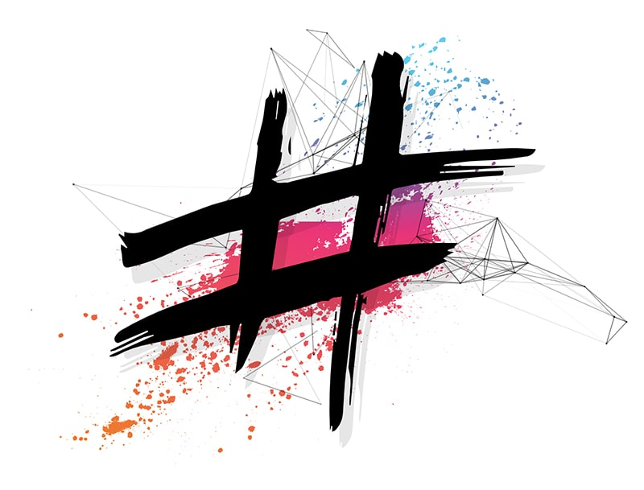

<p align="center">
  <a href="https://www.meshcss.com">
    
  </a>
</p>

<h1 align="center" style="font-size: 3.2em">
  meshCSS
</h1>
<p align="center">
  <a href="https://bundlephobia.com/result?p=meshcss">
    
  </a>
  <a href="https://www.codefactor.io/repository/github/ainsleyclark/mesh">
    
  </a>
  <a href="https://discord.gg/geBW7CN">
    
  </a>
  <a href="https://snyk.io/test/github/ainsleyclark/mesh?targetFile=package.json">
    
  </a>
  <a href="https://github.com/ainsleyclark/mesh/issues">
    
  </a>
  <a href="https://david-dm.org/ainsleyclark/mesh">
    
  </a>
  <a href="https://github.com/ainsleyclark/mesh/blob/master/LICENSE">
    
  </a>
</p>

<p align="center">
  A blazingly fast, versatile, pure CSS framework <br>
  with a modular approach to a responsive grid system and a <br>
  vast amount of utilities.<br>
</p>

<p align="center">
  <a href="https://www.meshcss.com/"><strong>## Go to Docs ##</strong></a>
</p>

<!-- START doctoc generated TOC please keep comment here to allow auto update -->
<!-- DON'T EDIT THIS SECTION, INSTEAD RE-RUN doctoc TO UPDATE -->

## Table of Contents
  - [Why meshCSS?](#why-meshcss)
  - [Getting Started](#getting-started)
  - [Documentation](#documentation)
  - [Contributing](#contributing)
  - [Donate](#donate)
  - [Contributors](#contributors)
  - [Browser Support](#browser-support)
  - [Licence](#licence)

<!-- END doctoc generated TOC please keep comment here to allow auto update -->

**Please note: meshBuilder, forms, toasts, nav, header are still work in progress**

## Why meshCSS?

meshCSS is a pureCSS framework built on a responsive grid system, featuring an array of pure dynamic components, such as modals, tabs, alerts and many more. Better yet,
it's extremely quick - <strong>100kb minified.</strong><br />
mesh was specifically built with a modular approach, to allow you to cut back on classes and components by using our sass files or our unique meshBuilder.<br/>
In addition, mesh has a huge amount of very useful utility classes and it's built entirely around flexbox, which enables you to write HTML quicker.<br/>
Simple, concise and easy to pick up, mesh will save you time and make layouts a breeze.

## Getting Started

Head over to the [installation](https://meshcss.com/documentation/getting-started/installation) page for more details on how to download and install mesh. Here are a few options to get you started.

- **meshBuilder** - We recommend you visit the [meshBuilder](https://www.meshcss.com/builder) before downloading. With this powerful tool, you only download the components/utilities you need and you can change variables such as colors and spacing.
- **Direct download** - Download the [latest release](https://github.com/ainsleyclark/mesh/releases/latest) with pre-compiled CSS.
- **npm** - Install with [npm](https://npmjs.com) to get all source files as they are available on Github: ```npm install meshcss```.
- **CDN** - Load CSS via CDN from [jsDelivr](https://cdn.jsdelivr.net/gh/ainsleyclark/mesh@master/dist/css/mesh.min.css): https://cdn.jsdelivr.net/gh/ainsleyclark/mesh@master/dist/css/mesh.min.css


## Documentation

Documentation for each utility and component can be found under the documentation folder. Alternatively, you can visit [meshcss.com](https://www.meshcss.com) to see visual examples & code snippets.

## Contributing 

mesh welcomes contributors, but please read the [contributing document](CONTRIBUTING.md) before making a pull request. You can also browse the [issues](https://github.com/ainsleyclark/mesh/issuesissues) or [help wanted](https://github.com/ainsleyclark/mesh/pulls?q=is%3Apr+is%3Aopen+label%3A%22help+wanted%22) section found above.
We advise that you get yourself familiar with grid system, utilities and components at [meshCSS](https://www.meshcss.com) to see how things work before contributing.


## Donate
Maintaining & updating mesh is time consuming. If you want to sponsor us or just buy us a coffee, it would be greatly appreciated. You can help keep meshCSS alive by donating. 
<br>Please visit [our donation page](https://www.paypal.com/cgi-bin/webscr?cmd=_s-xclick&hosted_button_id=HEC5AZCBWH2B6&source=url) to contribute to the project - even a small amount helps.

## Contributors

<p float="left">
	<a href="https://github.com/ainsleyclark"></a>
	<a href="https://github.com/nicholsk18"></a>
	<a href="https://github.com/Hazetheai"></a>
	<a href="https://github.com/versustune">
	<a href="https://github.com/kassuro"></a>
</p>

## Browser Support

- Chrome 35+
- Firefox 31+
- Safari 9+
- Opera
- Edge
- IE 11+

Many thanks to Browserstack for ensuring meshCSS works on multiple browsers.<br/>
<a href="https://www.browserstack.com/">
  
</a>

## Licence
Code Copyright 2018 mesh. Code released under the [MIT Licence](LICENCE).
